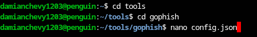
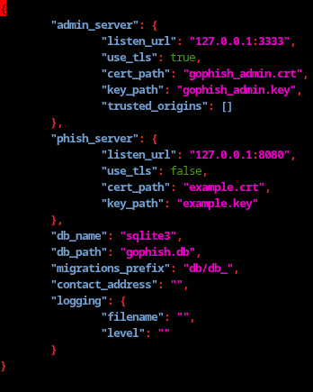
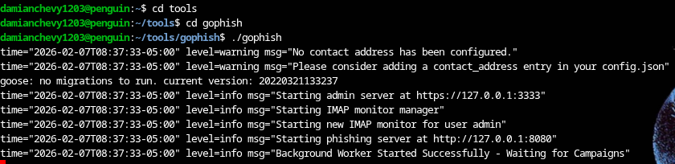
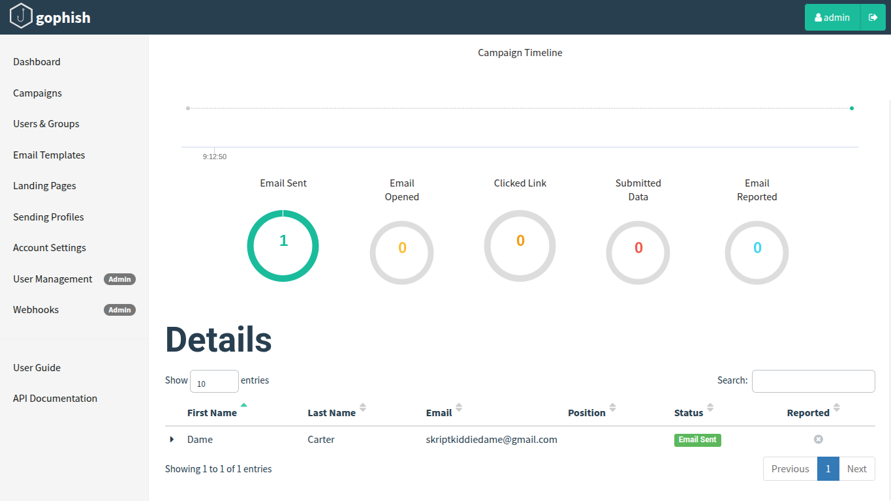
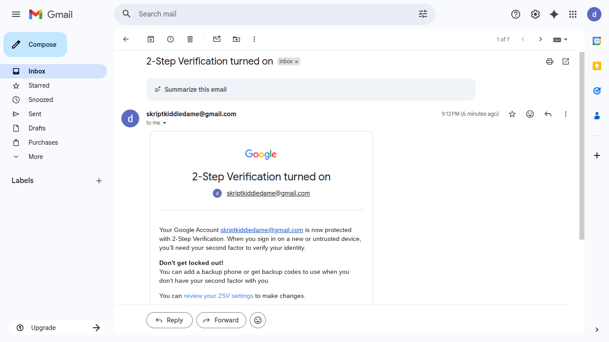
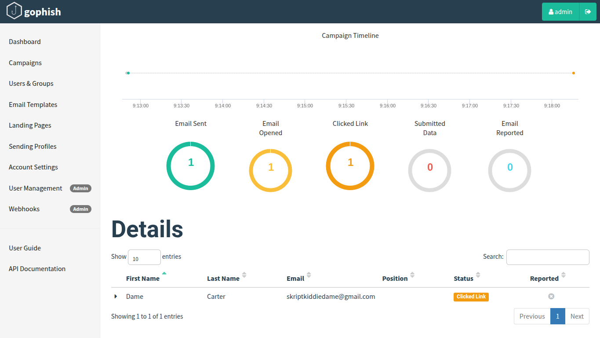

# GoPhish Phishing Awareness Lab

## Project Overview
This project demonstrates a controlled phishing awareness simulation conducted in a secure lab environment using **GoPhish**. The objective was to understand common phishing techniques, analyze user interaction, and explore defensive strategies that organizations can use to reduce social engineering risk.

⚠️ **Ethical Notice:**  
This lab was performed using isolated infrastructure and test accounts only. No real users, credentials, or external targets were involved.

---

## Lab Architecture

  

## Linux Environment Setup

  

The GoPhish lab was deployed and managed from a Linux environment to strengthen familiarity with command-line operations and security tooling commonly used by analysts and system administrators.

### Directory Navigation
Using the terminal, project directories were created and accessed to organize tooling and configuration files.

**Key commands used:**
- `cd` – Navigated between directories  
- `ls` – Verified file locations  
- `nano` – Edited configuration files directly from the terminal  

---

  

### Configuration Management
The `config.json` file was reviewed and modified to configure both the **admin server** and **phishing server**.

**Notable configurations included:**
- Setting admin interface listener (`127.0.0.1:3333`)
- Defining phishing server port
- Enabling TLS for secure admin access
- Validating certificate and key paths

This process reinforced understanding of how security tools rely on structured configuration files for infrastructure setup.

---

  

### Launching the GoPhish Service
After configuration was completed, GoPhish was executed from the terminal to start both the phishing server and administrative dashboard.

This provided hands-on experience with:

- Running security tools in Linux  
- Managing local services  
- Verifying port bindings  
- Troubleshooting startup issues  

---

## Campaign Dashboard

  

The GoPhish dashboard provided centralized visibility into campaign performance, enabling monitoring of email delivery, opens, clicks, and overall engagement.

---

## Email Template Example

  

A realistic email scenario was created to replicate common phishing tactics such as urgency and account verification prompts.

---

## Landing Page Simulation

  

The landing page was hosted within the lab to safely track user interaction after link clicks without collecting sensitive information.

---

## Campaign Results

  

Metrics collected from the simulation helped illustrate how phishing attacks succeed and reinforced the importance of user awareness training.

---

## Tools & Technologies
- GoPhish  
- Linux  
- SMTP Configuration  
- HTTP/HTTPS  
- Networking Fundamentals  
- Security Awareness Practices  

---

## Skills Demonstrated
- Phishing attack simulation in a controlled environment  
- Security-focused infrastructure setup  
- Social engineering risk analysis  
- Technical documentation  
- Threat awareness and defensive thinking  

---

## Key Takeaways
- Users are more likely to engage with emails that create urgency.
- Sender domain verification is critical in identifying phishing attempts.
- Security awareness training significantly reduces organizational risk.

---

## Future Improvements
- Deploy the lab using Docker for portability  
- Integrate logs with a SIEM for alert simulation  
- Create multiple phishing scenarios for behavioral comparison  
- Implement defensive email filtering rules  

---

## Author
**Damian Chevalier**  
Cybersecurity Enthusiast | Aspiring SOC Analyst

