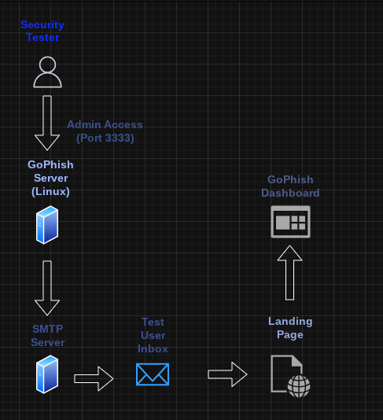

# GoPhish Phishing Awareness Lab

## Overview
This project demonstrates a **controlled phishing awareness simulation** built using **GoPhish** in a safe lab environment.  
The goal of this lab is to understand how phishing attacks are conducted, how users interact with malicious emails, and how security teams can detect and mitigate these threats.

⚠️ This project is for **educational and defensive purposes only**. No real users were targeted.

---

## Objectives
- Understand common phishing attack techniques
- Simulate phishing campaigns in a controlled environment
- Analyze user interaction metrics
- Improve security awareness and email defense strategies

---

## Tools & Technologies
- GoPhish
- Linux
- SMTP
- HTTP / HTTPS
- Basic Networking (ports, localhost, routing)

---

## Lab Architecture

1.  GoPhish server hosted locally
2.  Email sending profile configured with test SMTP
3.  Landing page hosted for interaction tracking
4.  Campaign metrics analyzed via GoPhish dashboard

## Lab Architecture

1. GoPhish server hosted locally
2. Email sending profile configured with test SMTP
3. Landing page hosted for interaction tracking
4. Campaign metrics analyzed via GoPhish dashboard

---

## Key Features
- Campaign creation and management
- Landing page tracking
- Email open and click-through analysis
- Reporting on phishing indicators and risks

---

## Findings & Takeaways
- Phishing emails relying on urgency resulted in higher interaction rates
- Clear domain mismatches are a strong indicator of malicious intent
- Security awareness training significantly reduces risk exposure

---

## Ethical Notice
This project was conducted in a **closed lab environment** using test accounts and dummy data.  
No real credentials, personal data, or live targets were used.

---

## Future Improvements
- Add Docker-based deployment
- Integrate phishing email header analysis
- Simulate detection via SIEM alerts
- Add defensive email filtering rules

---

## Author
Damian Chevalier
